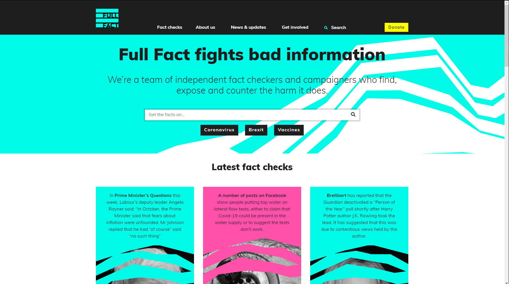

# Fact Website

# Table Of Contents

## sys requirements

## Research
<!--  https://fullfact.org  -->
<!--  https://www.howstuffworks.com  -->


> asd
>
>

<br> 
<br>

<div style="width: 50%; float: left; padding-right:2%;" >


</div>
The mobile version of the website scales some elements, and changes the layout as not all elements fit across. this prevents elements becoming too small, preventing the user to read and properly interpret the page.

Reducing the navbar into a dropdown also helps leviate page readability. 
<div style="padding-top:40%"></div>

Both versions provide identical functionality, but are pressented differently for compatibility with each type of system.

The website includes a seacrh bar for querying facts. search bar is present on both the homepage and on the navbar (shown when dropdown active on mobile)


## bussiness context and requirements

## limitations

## user requirements
<!--what user expect out of experience, functionality
    how will benifiting user benifit bussiness-- retention span
-->

## functional requirements

## non-functional requirements

## legal and ethical requirements
<!---->

## Testing
<!--test tables, QA, automatic-unit -> iterative/regresion -->


## Design


>
>>aaa
>>
>
>

## MEAN/MERN
### Mongo CRUD
<!--data design-->

>
>``` javascript
>   
>```
>

### Express Server
<!--api, data access-->
<!--sequence-->
###
<!--gui design -->
<!--element wireframe-->
### Node

### web

# implementation
## Dependencies
<!--mongo, express, react, jest-->
installing dependencies.
> ```bat
> npm i mongoose
> npm i express
> npm i jest
> ```
>
>
> including react
> ```html 
><script src=""></script> 
>```
>
>to use react with dom elements
> include jsx/babel
><script src=""></script>
>


## test documentation
### test tables
### usability testing 


## Assessment
<!-- assess testing implications throughout-->
<!--does it relay conditions (state data usage, ) to user-->
<!---KPIS && requirements met-->
<!--suitability-->
<!--ease of use, >
<!--accessability met-->


# References


